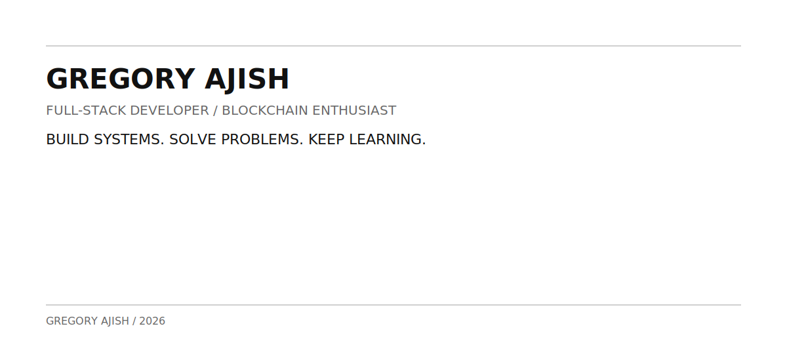
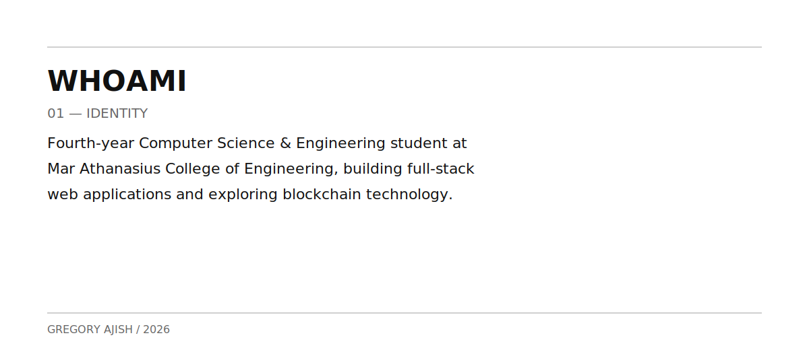
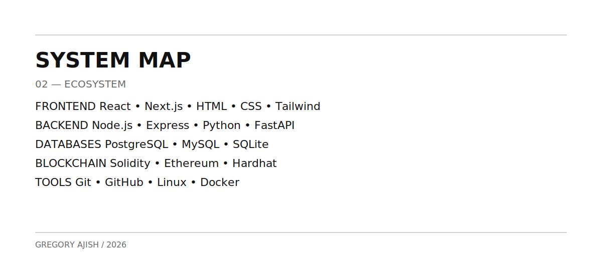
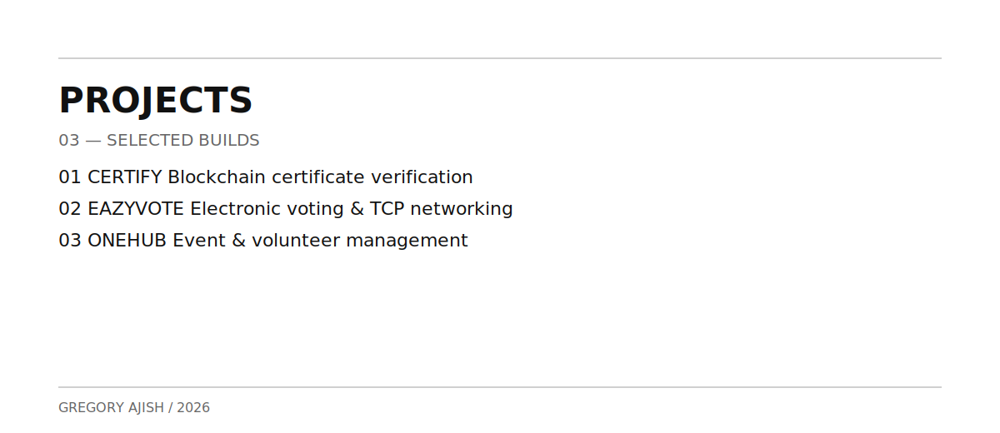
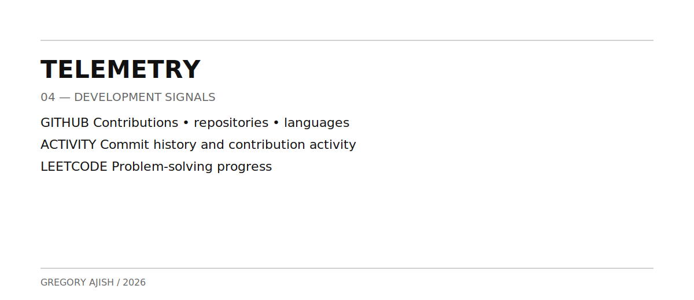
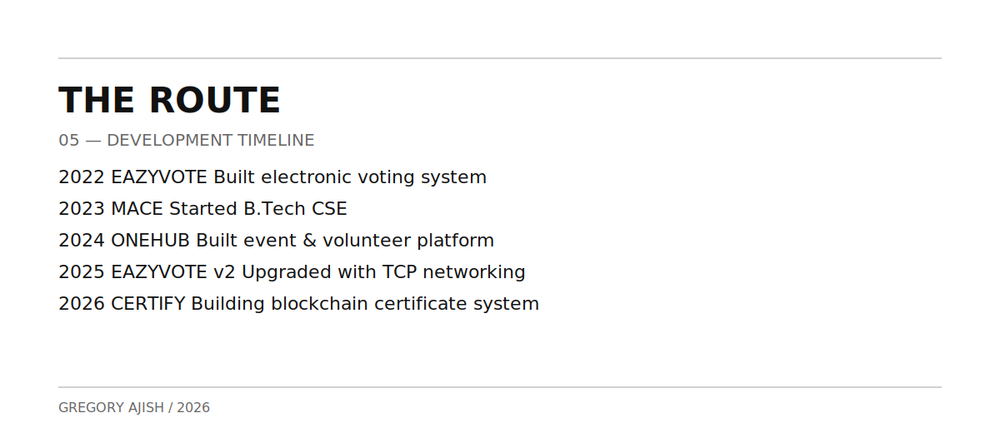
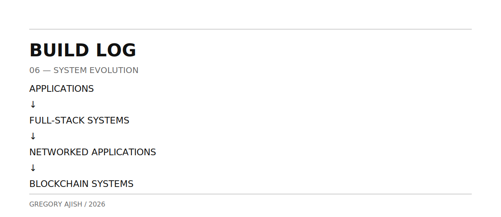
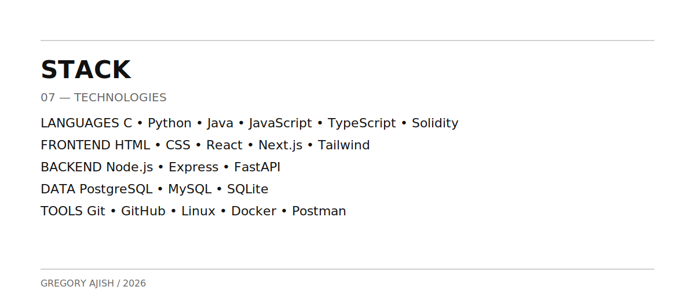
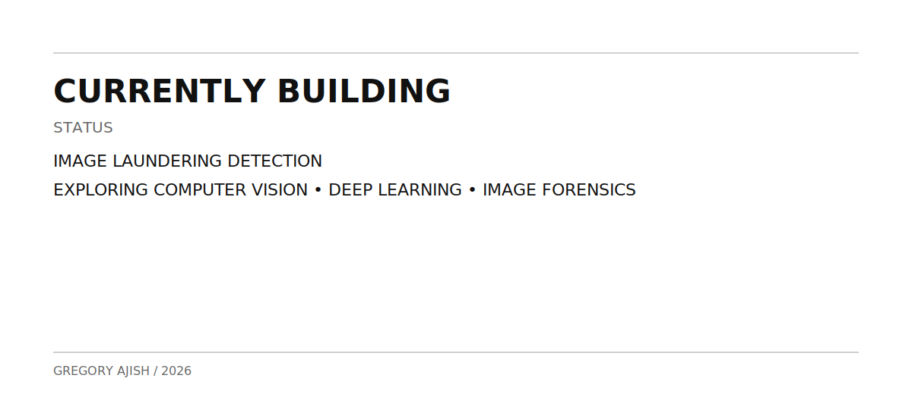

<picture>
  <source media="(prefers-color-scheme: dark)" srcset="assets/dark/header-v1.svg"/>
  
</picture>

 

---

<picture>
  <source media="(prefers-color-scheme: dark)" srcset="assets/dark/whoami.svg"/>
  
</picture>

<picture>
  <source media="(prefers-color-scheme: dark)" srcset="assets/dark/ecosystem.svg"/>
  
</picture>

---

<picture>
  <source media="(prefers-color-scheme: dark)" srcset="assets/dark/projects.svg"/>
  
</picture>

### CERTIFY

**Blockchain-Based Certificate Verification System**

React • Node.js • PostgreSQL • Solidity • Hardhat

 

### EAZYVOTE

**Electronic Voting System**

Python • Tkinter • MySQL • TCP Socket Programming

Originally built in **2022** and later upgraded with networking capabilities for centralized real-time vote synchronization.

 

### ONEHUB

**Event & Volunteer Management Platform**

Full-Stack Web Application for managing events, volunteers, and participation.

Built in **2024**.

---

<picture>
  <source media="(prefers-color-scheme: dark)" srcset="assets/dark/telemetry.svg"/>
  
</picture>

 

 

---

<picture>
  <source media="(prefers-color-scheme: dark)" srcset="assets/dark/timeline.svg"/>
  
</picture>

<picture>
  <source media="(prefers-color-scheme: dark)" srcset="assets/dark/build-log.svg"/>
  
</picture>

<picture>
  <source media="(prefers-color-scheme: dark)" srcset="assets/dark/stack.svg"/>
  
</picture>

---

<picture>
  <source media="(prefers-color-scheme: dark)" srcset="assets/dark/footer.svg"/>
  
</picture>

### BUILD. LEARN. SOLVE.

